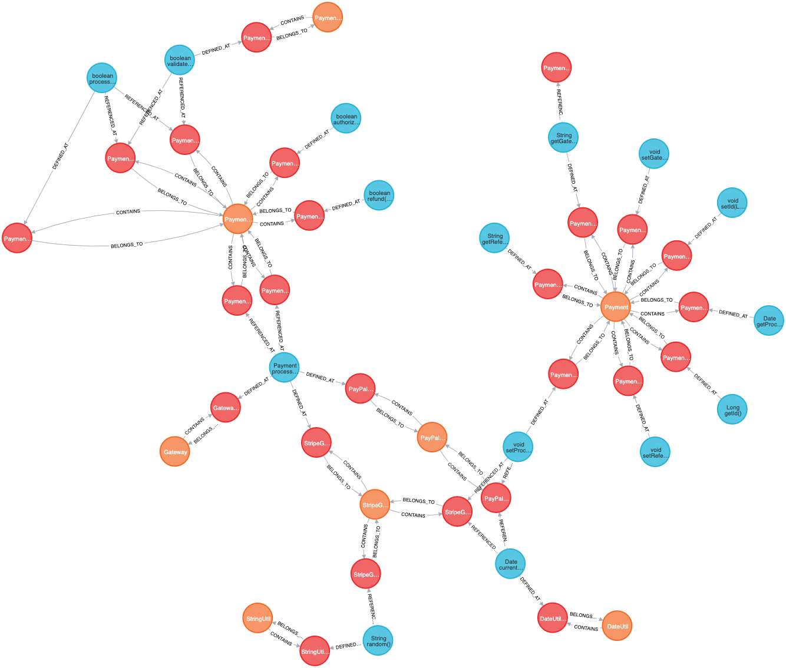

# graph-test

Stupidly simple project to try GitHub's code navigation features.

You can find the queries to build the graph in the [graph.cql](graph.cql) file.

Here is a preview of how the graph looks:

